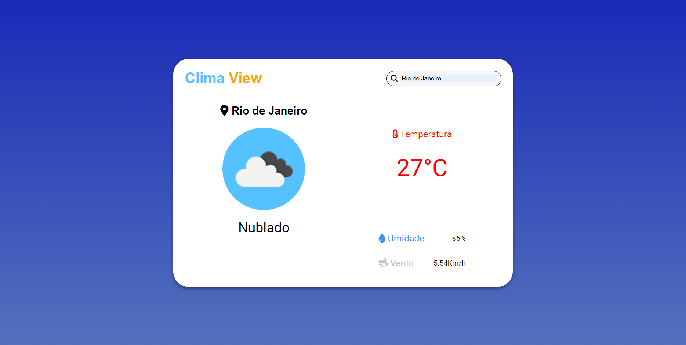

<h1 align="center"> Clima Viewer </h1>

Site para ver o clima de uma região.  

  <a href="#-tecnologias">Tecnologias</a>&nbsp;&nbsp;&nbsp;|&nbsp;&nbsp;&nbsp;
  <a href="#-projeto">Projeto</a>

 

  

## 🚀 Tecnologias

Esse projeto foi desenvolvido com as seguintes tecnologias:

- HTML e CSS
- JavaScript
- Git e Github

## 💻 Projeto

O Clima Viewer é um projeto para ver o clima de uma cidade a escolha do usuário

- [Acesse o projeto finalizado, online](https://clima-viewer.vercel.app)
